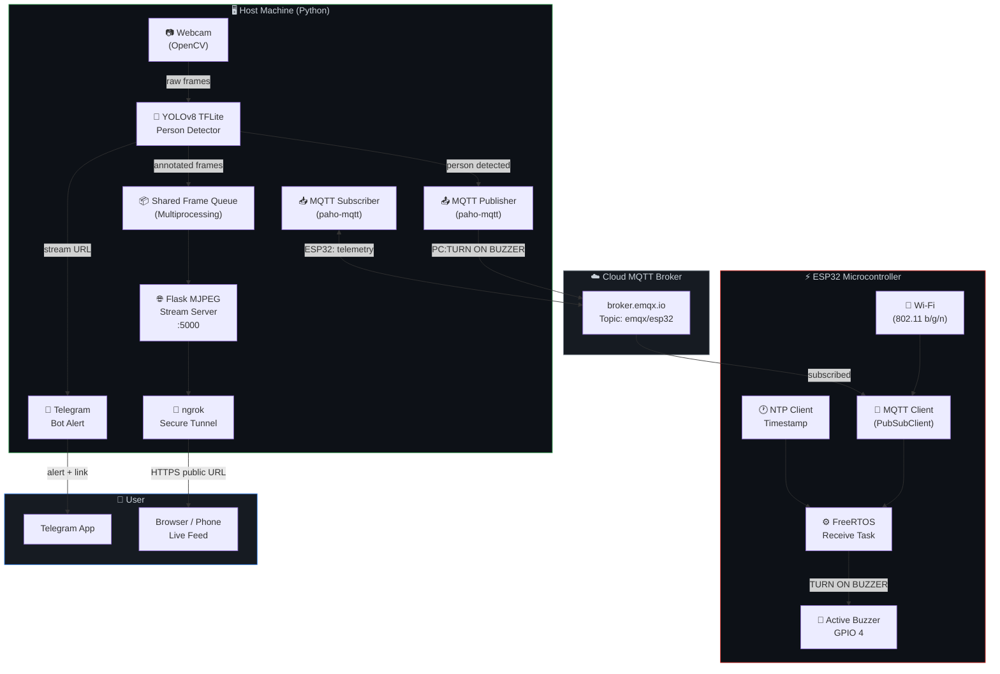
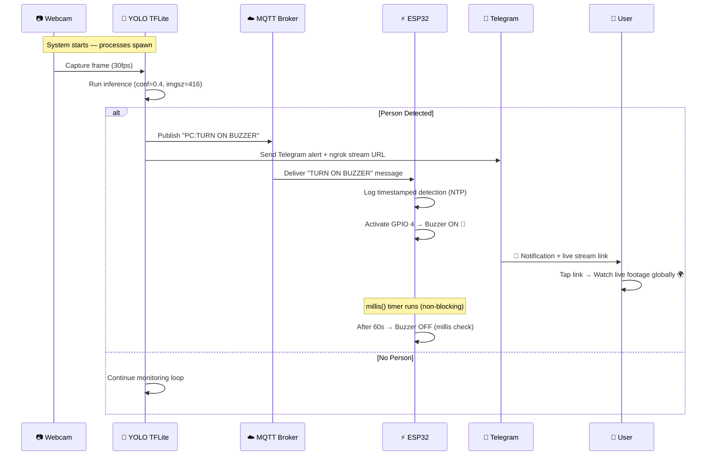

<div align="center">

# 🎥 AI-Enabled Smart CCTV System

### Real-time Person Detection · Remote Streaming · IoT Hardware Alert

[](https://www.python.org/)
[](https://docs.ultralytics.com/)
[](https://www.espressif.com/)
[](https://mqtt.org/)
[](https://flask.palletsprojects.com/)
[](https://core.telegram.org/bots)
[](https://ngrok.com/)
[](LICENSE)

> An end-to-end AI-powered security system that detects persons in real-time using a **YOLOv8 TFLite model**, streams live footage globally over **ngrok**, sends instant **Telegram alerts**, and triggers a physical **buzzer via ESP32** — all orchestrated over MQTT.

</div>

---

## 📖 Table of Contents

- [✨ Key Features](#-key-features)
- [🏛️ System Architecture](#️-system-architecture)
- [🔄 Data Flow Diagram](#-data-flow-diagram)
- [🧱 Component Overview](#-component-overview)
- [🛠️ Technology Stack](#️-technology-stack)
- [⚙️ Hardware Requirements](#️-hardware-requirements)
- [🚀 Getting Started](#-getting-started)
  - [Python Host Setup](#1-python-host-setup)
  - [ESP32 Firmware Setup](#2-esp32-firmware-setup)
- [📁 Project Structure](#-project-structure)
- [📬 How It Works](#-how-it-works)
- [🔮 Future Improvements](#-future-improvements)
- [📄 License](#-license)

---

## ✨ Key Features

| Feature | Description |
|---|---|
| 🧠 **Edge AI Inference** | Runs a custom-trained **YOLOv8 TFLite** model locally — no cloud dependency for detection |
| 📡 **MQTT Communication** | Bidirectional messaging between PC and ESP32 via a public MQTT broker |
| 🌍 **Global Live Streaming** | Flask MJPEG stream exposed worldwide via **ngrok** secure tunnel |
| 📲 **Telegram Alerts** | Instant bot notification with the live stream link when a person is detected |
| 🔔 **Hardware Buzzer Alert** | Physical buzzer on ESP32 activates on person detection |
| ⏱️ **Non-blocking ESP32** | ESP32 uses `millis()` timer — stays MQTT-connected throughout the alert cycle |
| 🔐 **Secure Config** | Credentials managed via `.env` — no hardcoded secrets in code |
| 🤝 **Multiprocess Architecture** | Detection, streaming, and MQTT run as independent OS processes |

---

## 🏛️ System Architecture



---

## 🔄 Data Flow Diagram



---

## 🧱 Component Overview

### 🖥️ Python Host (`smart_cctv_python code.py`)

The Python application runs **three parallel processes** using Python's `multiprocessing` module:

```
┌─────────────────────────────────────────────────────────────────────┐
│                         Python Application                          │
│                                                                     │
│  ┌──────────────────┐  ┌──────────────────┐  ┌──────────────────┐  │
│  │  Main Process    │  │  Flask Process   │  │  MQTT Rx Process │  │
│  │                  │  │                  │  │                  │  │
│  │ • ngrok launch   │  │ • MJPEG stream   │  │ • Subscribe all  │  │
│  │ • Telegram alert │  │ • /video_feed    │  │   ESP32 msgs     │  │
│  │ • YOLO inference │  │ • Serve frames   │  │ • Queue incoming │  │
│  │ • MQTT publish   │  │   from queue     │  │   telemetry      │  │
│  └──────────────────┘  └──────────────────┘  └──────────────────┘  │
│           │                     ▲                                   │
│           └──── Frame Queue ────┘  (multiprocessing.Queue)          │
└─────────────────────────────────────────────────────────────────────┘
```

### ⚡ ESP32 Firmware (`esp32_code_cctv.ino`)

The ESP32 runs two concurrent FreeRTOS tasks:

```
┌─────────────────────────────────────────────────────────────────────┐
│                        ESP32 Firmware                               │
│                                                                     │
│  ┌────────────────────────────┐  ┌─────────────────────────────┐   │
│  │  FreeRTOS: Receive Task    │  │  Arduino: loop()            │   │
│  │                            │  │                             │   │
│  │ • mqtt_client.loop()       │  │ • Check last_received_msg   │   │
│  │ • Reconnect on drop        │  │ • Trigger buzzer (millis)   │   │
│  │ • Store msg to global buf  │  │ • Non-blocking 60s timer    │   │
│  │ • vTaskDelay: 10ms         │  │ • Log NTP timestamp         │   │
│  └────────────────────────────┘  └─────────────────────────────┘   │
└─────────────────────────────────────────────────────────────────────┘
```

---

## 🛠️ Technology Stack

| Layer | Technology | Purpose |
|---|---|---|
| **AI / Vision** | [Ultralytics YOLOv8](https://docs.ultralytics.com/) + TFLite | Person detection & tracking |
| **Computer Vision** | OpenCV (`cv2`) | Frame capture, annotation, encoding |
| **Web Server** | Flask | MJPEG live video stream endpoint |
| **Tunneling** | ngrok | Expose local stream to the internet |
| **Messaging** | MQTT (paho-mqtt) | PC ↔ ESP32 command channel |
| **Notifications** | python-telegram-bot | Bot alerts with stream link |
| **Microcontroller** | ESP32 + Arduino + FreeRTOS | Hardware buzzer actuation |
| **IoT Protocol** | PubSubClient (Arduino) | MQTT on ESP32 |
| **Time Sync** | NTPClient (Arduino) | Timestamped detection logging |
| **Config** | python-dotenv | Environment-based secrets management |
| **Concurrency** | Python `multiprocessing` | Parallel detection, streaming, MQTT |

---

## ⚙️ Hardware Requirements

| Component | Specification |
|---|---|
| 💻 **PC / Laptop** | Any machine with a webcam and Python 3.10+ |
| 📟 **Microcontroller** | ESP32 (any variant with Wi-Fi) |
| 🔔 **Buzzer** | Active buzzer module — Data pin → GPIO 4 |
| 📡 **Network** | Wi-Fi (both PC and ESP32 on internet) |

### Wiring

```
ESP32 GPIO 4  ──────►  Buzzer DATA pin
ESP32 3.3V    ──────►  Buzzer VCC
ESP32 GND     ──────►  Buzzer GND
```

---

## 🚀 Getting Started

### 1. Python Host Setup

**Clone the repository:**
```bash
git clone https://github.com/Nithinpbabu/AI-enabled-smart-CCTV-USING-TFlite.git
cd AI-enabled-smart-CCTV-USING-TFlite
```

**Install dependencies:**
```bash
pip install -r requirements.txt
```

**Configure environment variables:**
```bash
# Copy the example env file
cp .env.example .env
```

Edit `.env` with your credentials:
```env
BOT_TOKEN=your_telegram_bot_token_here
CHAT_ID=your_telegram_chat_id_here
MQTT_BROKER=broker.emqx.io
MQTT_PORT=1883
MQTT_TOPIC=emqx/esp32
MODEL_PATH=best_float32.tflite
```

> **Get your Telegram credentials:**
> - Create a bot via [@BotFather](https://t.me/BotFather) to get `BOT_TOKEN`
> - Get `CHAT_ID` by visiting: `https://api.telegram.org/bot<YOUR_TOKEN>/getUpdates`

**Set up ngrok:**

> 📥 **Download ngrok from the official site:** [https://ngrok.com/download](https://ngrok.com/download)
> *(Choose your OS, extract, and place `ngrok` on your PATH — do **not** commit the binary to git)*

```bash
# Authenticate ngrok with your account token (one-time setup):
ngrok config add-authtoken <your_ngrok_authtoken>
```

> 🔑 Get your authtoken from your [ngrok dashboard](https://dashboard.ngrok.com/get-started/your-authtoken) after free sign-up.

**Run the application:**
```bash
python "smart_cctv_python code.py"
```

---

### 2. ESP32 Firmware Setup

**Install required Arduino libraries** (via Library Manager in Arduino IDE):
- `PubSubClient` by Nick O'Leary
- `NTPClient` by Fabrice Weinberg
- `WiFi` (built-in ESP32 core)

**Configure credentials** in `esp32_code_cctv/esp32_code_cctv.ino`:

```cpp
// Line 11-12: Set your Wi-Fi credentials
const char *ssid = "YOUR_WIFI_SSID";
const char *password = "YOUR_WIFI_PASSWORD";

// Line 16: Must match MQTT_TOPIC in your .env
const char *mqtt_topic = "emqx/esp32";
```

**Flash** the sketch to your ESP32 and connect the buzzer to **GPIO 4**.

---

## 📁 Project Structure

```
AI-enabled-smart-CCTV-USING-TFlite/
│
├── smart_cctv_python code.py   # Main application — detection, stream, alerts
├── best_float32.tflite         # Custom-trained YOLOv8 TFLite model (~12 MB)
├── requirements.txt            # Python dependencies
├── .env.example                # Environment variable template (safe to commit)
├── .env                        # ⚠️  Your secrets — git-ignored, never commit
├── .gitignore                  # Excludes secrets, binaries & build artifacts
├── LICENSE                     # MIT License
│
└── esp32_code_cctv/
    └── esp32_code_cctv.ino     # Arduino sketch — Wi-Fi, MQTT, FreeRTOS, buzzer

# ⚠️  NOT in repo (download separately):
# ngrok  →  https://ngrok.com/download
```

---

## 📬 How It Works

1. **On startup**, the Python app spawns three OS-level processes: the YOLO detection engine, Flask video server, and MQTT subscriber.
2. **ngrok** is launched automatically and tunnels port `5000` to a public HTTPS URL.
3. A **Telegram message** is sent to the configured chat with the live camera link.
4. **Every frame** from the webcam is run through the YOLOv8 TFLite model at `conf=0.4`, filtering for `class=0` (person).
5. When a **person is detected**, the Python app publishes `"PC:TURN ON BUZZER"` to the MQTT topic.
6. The **ESP32**, subscribed to the same topic, receives the command, logs the NTP timestamp, and activates the GPIO buzzer.
7. The buzzer stays **ON for 60 seconds** via a non-blocking `millis()` timer — keeping MQTT live throughout.
8. **Annotated frames** (with bounding boxes) are pushed to the shared queue, streamed via Flask, and available to view globally through the ngrok URL.

---

## 🔮 Future Improvements

- [ ] 🌙 Night-vision support with IR camera integration
- [ ] 📸 Snapshot capture on detection + attach to Telegram alert
- [ ] 🗄️ SQLite detection log with timestamps and counts
- [ ] 📊 Web dashboard with live detection statistics
- [ ] 🔇 Configurable buzzer duration via MQTT command
- [ ] 🧑‍🤝‍🧑 Multi-class detection (vehicles, animals, etc.)
- [ ] 🔋 Battery-powered ESP32 with deep sleep idle mode
- [ ] 📦 Docker containerization for easy deployment

---

## 📄 License

This project is licensed under the **MIT License** — see the [LICENSE](LICENSE) file for details.

---

<div align="center">

**Made with ❤️ | Computer Vision · IoT · Edge AI**

⭐ Star this repo if you found it useful!

</div>
